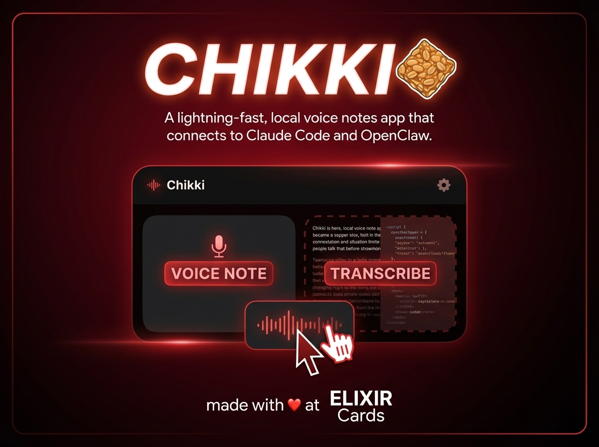

<p align="center">
  
</p>

# 🍫 Chikki

Local, private meeting transcription and notes for macOS.  
Record → transcribe (on-device) → summarize (Gemini / OpenAI / Anthropic) → markdown notes.

---

## Features

- **On-device transcription** via [mlx-whisper](https://github.com/ml-explore/mlx-examples), [parakeet-mlx](https://github.com/senstella/parakeet-mlx), or IndicWhisper — no audio leaves your machine
- **Multiple LLM providers** — Gemini, OpenAI, or Anthropic (your key, your choice)
- **Meeting-type prompts** — default, standup, strategy, 1:1, brainstorm, interview
- **Menu bar app** — native Swift, global hotkey (`Cmd+Shift+R`), live progress stages
- **CLI** — record, transcribe, process, reprocess with different meeting types
- **Markdown notes** — structured output with action items, decisions, and key points

---

## Requirements

- macOS 14+
- [Miniconda](https://docs.conda.io/en/latest/miniconda.html)
- Xcode Command Line Tools (`xcode-select --install`)
- One of: Google API key, OpenAI API key, or Anthropic API key

---

## Install

```bash
git clone https://github.com/yourusername/chikki.git
cd chikki
./install.sh
```

`install.sh` creates the conda env, installs Python deps, sets up config files, and builds the Swift menu bar app. Safe to re-run.

After install, edit `.env` and add your API key. If not using Gemini, also update `config.yaml` → `processing.provider`.

---

## Usage

```bash
conda activate chikki

# Record + transcribe + summarize in one go (Ctrl+C to stop recording)
python -m src.cli quick

# With options
python -m src.cli quick --engine parakeet --type standup

# Just record
python -m src.cli record

# Process an existing audio file
python -m src.cli process path/to/audio.wav --type interview

# Re-summarize a saved transcript with a different meeting type
python -m src.cli reprocess transcripts/20260323_meeting.json --type strategy

# Process the most recent recording (used by the menu bar app)
python -m src.cli process-latest

# List all notes
python -m src.cli list-notes
```

### Key flags

| Flag | Description |
|------|-------------|
| `--engine/-e` | Transcription engine: `whisper`, `parakeet`, `indicwhisper` |
| `--type/-t` | Meeting type (see `python -m src.cli types`) |
| `--context/-c` | Additional context passed to the LLM |
| `--duration/-d` | Max recording duration in seconds |

---

## Menu Bar App

```bash
# Build
cd menubar && ./build.sh

# Launch
open menubar/build/Chikki.app
```

Click the mic icon to start/stop recording. Shows live progress stages during processing. Configure the global hotkey in the Settings panel.

---

## Configuration

`install.sh` copies `config.yaml.example` → `config.yaml`. Key settings:

```yaml
processing:
  provider: gemini        # gemini | openai | anthropic
  model: gemini-2.5-flash # model name for the chosen provider
  temperature: 0.3

transcription:
  engine: whisper         # whisper | parakeet | indicwhisper
```

**Provider model examples:**

| Provider | Example models |
|----------|----------------|
| `gemini` | `gemini-2.5-flash`, `gemini-2.0-flash` |
| `openai` | `gpt-4o`, `gpt-4o-mini` |
| `anthropic` | `claude-opus-4-6`, `claude-sonnet-4-6` |

Meeting-type prompts live in `prompts.json` — edit freely without code changes.

---

## Transcription Engines

```bash
python -m src.cli engines
```

| Engine | Best for |
|--------|----------|
| `whisper` (default) | General purpose, 99 languages, good Indian English |
| `parakeet` | ~10x faster than Whisper, better noise robustness, English-only |
| `indicwhisper` | Indian languages + Hindi-English code-switching |

---

## Meeting Types

```bash
python -m src.cli types
```

| Type | Description |
|------|-------------|
| `default` | General meeting notes |
| `standup` | Daily standup format |
| `strategy` | Strategy session with options and decisions |
| `one_on_one` | 1:1 meeting notes |
| `brainstorm` | Idea capture session |
| `interview` | Interview notes with Q&A format |

---

## Output Structure

```
notes/          — Markdown notes (title, summary, action items, etc.)
transcripts/    — Raw transcripts (.txt + .json) for reprocessing
recordings/     — Raw audio files
```

---

## Project Layout

```
src/
  cli.py          CLI entry point (9 commands)
  recorder.py     Audio recording (sounddevice)
  transcriber.py  Multi-engine transcription dispatch
  processor.py    LLM summarization (gemini / openai / anthropic)
  output.py       Markdown note writing
  cleaner.py      Transcript cleaning and formatting
  config.py       Config loader (.env + config.yaml)
  hotkey.py       macOS keyboard shortcut setup helper
menubar/      Native Swift menu bar app (SPM)
config.yaml       Runtime settings (gitignored — copy from .example)
prompts.json      Meeting type prompt templates
```

---

## Contributing

Contributions are welcome! Here's how to get started:

1. Fork the repo and clone your fork
2. Run `./install.sh` to set up the environment
3. Create a branch for your feature or fix
4. Make your changes and add tests where applicable
5. Run the tests: `conda run -n chikki python -m pytest tests/ -v`
6. Open a pull request

Some areas where help would be appreciated:

- **Local LLM support** — wire up Ollama or llama.cpp as a provider in `_call_llm`
- **Real-time transcription** — streaming Whisper for live captions during recording
- **Better Hindi/English code-switching** — improved prompts or fine-tuned models for IndicWhisper
- **App icon** — the menu bar app needs a proper icon
- **Linux support** — the CLI pipeline should work, but the menu bar app is macOS-only

Please keep PRs focused — one feature or fix per PR. If you're planning something large, open an issue first to discuss the approach.

---

## License

MIT — see [LICENSE](LICENSE) for details.
